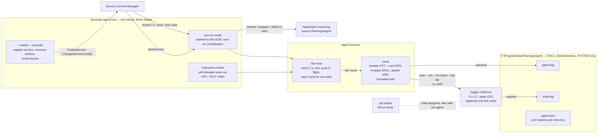
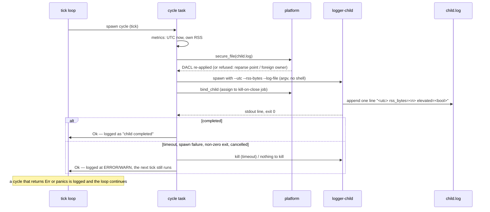
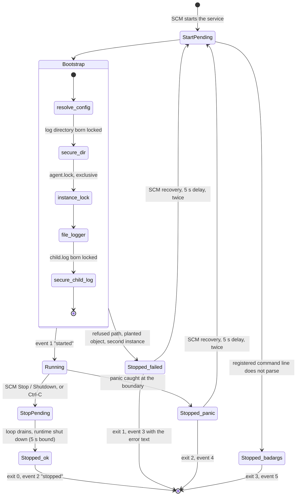

# FlamingoAgent

A Windows background service written in Rust that, every 5 seconds, samples the current UTC
time and its own resident memory (RSS), launches a small C++ child with those values, and
keeps the child's log file readable only by Administrators and SYSTEM. The core is portable;
Windows is the fully implemented platform.

```
.
├── agent-rust/       Rust service: install mode, ACL setup, metric loop, child spawning
├── logger-child/     C++17 child: logs its arguments to stdout and an ACL-protected file
├── install.ps1       Build both, install under Program Files, register the service
├── docs/design.md    Design document (architecture, security notes, test strategy)
└── .github/          CI: five jobs on every push (Linux, mutation testing on both, Windows, Windows service end-to-end)
```

## Confirmed interpretations

The brief allowed two readings in three places; these were raised with the assignment
author and confirmed:

| Topic | Decision |
|---|---|
| Child lifecycle | A fresh child per 5-second cycle, receiving the current metrics as arguments; it logs once and exits. The cadence lives in the agent. |
| "Administrator privileges" | As a service the agent runs as LocalSystem, so the child inherits the SYSTEM token and no elevation code runs. Run from a shell, the agent self-elevates once via UAC. |
| Cross-platform reach | Metric collection and child spawning are fully portable. On Linux/macOS the log restriction maps to a root-owned `0600` file and `--install` reports "unsupported" (systemd/launchd registration is the documented next step). |

## Architecture

Three views; the mechanism behind each is in [`docs/design.md`](docs/design.md) (§4 runtime
model, §5 the cycle, §6 the secure log, §7 installation).

**Components and trust boundary.** One binary, three modes. The service and everything it
spawns run as SYSTEM; the child's log lives in a directory that only Administrators and
SYSTEM can open, and every child is tied to the agent's lifetime through a job object.



**One cycle.** The DACL is re-applied immediately before every spawn, the child is bound to
the agent's job object before it can do anything else, and the wait is bounded by the
child timeout (4 s, shorter than the 5 s period) and by shutdown.



**Service lifecycle and failure paths.** Bootstrap is fatal only where the security
property cannot be guaranteed; everything after the loop starts is non-fatal by
construction. The SCM restarts a failed service twice, five seconds apart, then leaves it
stopped, and each transition is also written to the Application event log.



## Prerequisites (Windows)

- Rust stable with the default MSVC toolchain: https://rustup.rs
- Visual Studio Build Tools 2022 with the **Desktop development with C++** workload (includes CMake)

Nothing else. Both binaries link the C runtime statically, so no Visual C++ redistributable
is needed on the target machine.

## Build and install

From an **elevated** PowerShell in the repository root:

```powershell
powershell -ExecutionPolicy Bypass -File .\install.ps1
```

The script builds `flamingo-agent` (`cargo build --release`) and `logger-child` (CMake,
Release, x64), copies both to `C:\Program Files\FlamingoAgent\`, registers the
`FlamingoAgent` service (automatic start, LocalSystem) via `flamingo-agent.exe --install`,
starts it, and prints its status. Re-running the script reinstalls cleanly. The registration
includes recovery actions: if the service fails, the SCM restarts it after five seconds, twice,
then leaves it stopped, and a non-zero exit is treated like a crash so a transient start-up
failure recovers on its own. CI reads this back with `sc qfailure`.

To remove: `powershell -ExecutionPolicy Bypass -File .\install.ps1 -Uninstall`
(or `flamingo-agent.exe --uninstall`). Logs are kept.

## Running interactively

```powershell
& "C:\Program Files\FlamingoAgent\flamingo-agent.exe"
```

From a non-elevated shell this triggers one UAC prompt; the elevated instance runs the same
loop in its own console window and stops on Ctrl-C. Declining the prompt exits with code 3.

Useful flags: `--period-secs`, `--child-timeout-secs`, `--child-path`, `--log-dir`,
`--log-level`, `--log-max-bytes`, `--log-keep`. Run `flamingo-agent.exe --help` for details.

## Logs

Both files live in `C:\ProgramData\FlamingoAgent\` (Linux: `/var/log/flamingo-agent/`).

`agent.log` — one `metrics` line and one child outcome per cycle, plus the effective ACL at
start-up:

```
2026-09-11T20:35:00.101Z  INFO flamingo-agent starting mode="service" protection=D:PAI(A;;FA;;;BA)(A;;FA;;;SY) ...
2026-09-11T20:35:00.102Z  INFO metrics utc=2026-09-11T20:35:00.102Z rss_bytes=8421376
2026-09-11T20:35:00.140Z  INFO child completed child_stdout="2026-09-11T20:35:00.102Z rss_bytes=8421376 elevated=true"
```

`child.log` — one line per cycle, written by the child:

```
2026-09-11T20:35:00.102Z rss_bytes=8421376 elevated=true
```

The `elevated=` field is the child's own report of its token, so the "launched with
administrator privileges" requirement is visible in the data, not just asserted here.

**Rotation.** Both logs rotate by size: when a file reaches `--log-max-bytes` (default
10 MiB) it becomes `agent.1.log` or `child.1.log`, older generations shift up, and the one
past `--log-keep` (default 5) is deleted, so each log occupies at most six times the limit.
`agent.log` rotates inside the agent's own writer, between lines; `child.log` rotates between
children, so no writer ever holds the file being renamed. A rename preserves the security
descriptor, so rotated generations stay locked exactly like the live file, and the fresh
live file is born locked. A rotation that fails (a viewer holding the file open without
delete sharing) is logged and retried on the next line or cycle; it never stops the agent.

## How the ACL is enforced

The agent creates `child.log` (and its directory) **with** a security descriptor attached to
the create call, so the file is never observable with default permissions. The DACL is
expressed as SDDL:

| Object | SDDL |
|---|---|
| `child.log` | `D:P(A;;FA;;;BA)(A;;FA;;;SY)` |
| `FlamingoAgent\` | `D:P(A;OICI;FA;;;BA)(A;OICI;FA;;;SY)` |

`P` disables inheritance, which is the part that is easy to miss: without it the entries
inherited from `ProgramData` (which grant `Users` read access) would remain in effect. The
directory is locked as well because the right to delete or rename a file comes from its
parent directory, not from the file's own ACL. The DACL is re-applied immediately before
every child spawn, so the file is explicitly protected at the moment each child runs even if
an administrator removed it in between. The child only ever appends and never recreates the
file.

**Pre-planting is refused, not repaired.** Under `ProgramData` any user may create a
subdirectory before the service first starts, and a junction needs no privilege at all. If
the log directory or the child log already exists when the agent arrives, it is used only if
it is a real directory or file (not a reparse point, which would redirect SYSTEM's writes
wherever the planter chose) and its owner is Administrators or SYSTEM (an owner keeps the
implicit right to change the DACL, so a foreign owner could undo the lock). Anything else
makes the agent refuse to start with a clear message; it never takes ownership of a planted
object. On Linux the same rule applies to symbolic links and to a directory owned by another
user. This is proven in CI: a standard account plants a directory and a junction, and the
agent refuses both (evidence block 12).

## Testing

Portable code is tested automatically on Linux and Windows in CI; Windows-specific behavior
(DACL application, elevation check) has unit tests that run in the Windows CI job, which
executes as an administrator.

```bash
cd agent-rust && cargo test          # unit + integration tests (uses fixture children)
cmake -S logger-child -B logger-child/build && cmake --build logger-child/build && ctest --test-dir logger-child/build
```

What the tests cover: timestamp format, RSS availability, argument encoding, CLI validation,
path resolution, `0700`/`0600` protection on Unix, protected-DACL application on Windows,
refusal of planted symbolic links, junctions and foreign-owned objects, the instance lock,
the kill-on-close job object, event log reporting, child spawn/timeout/failure/cancellation
paths, the loop surviving errors and panics, the whole bootstrap-and-loop path in one
process, and the child's exit codes and append-only behavior.

### Coverage and test tiers

Measured line coverage is 92.70% on Linux and 78.00% on Windows (`cargo llvm-cov
--all-targets` on each job, CI run 34763931662). CI enforces a floor of 89% (`floor(92.70) - 3`)
on the `linux` job and 75% (`floor(78.00) - 3`) on the `windows` job, and publishes both lcov files as build
artifacts, so a coverage regression fails the build rather than being noticed later. The
Windows figure is lower because the code that only the end-to-end job exercises (the SCM
wrapper, `ServiceMain`, installation, the UAC relaunch) is measured there but not
instrumented: the end-to-end job runs the installed release binary, not a test build.

The tests fall into three tiers:

1. **Portable unit and integration tests**, run on every commit on both Linux and Windows.
   These include property-based tests of the Windows argument-quoting logic, which check
   quoting round-trips through a reference command-line parser and, on the Windows job, also
   against the real `CommandLineToArgvW`.
2. **Privileged tests**: on Linux, a `sudo`-run job on the CI runner exercises the
   root-owned `0600` log path, a full interactive run of the agent that is stopped with
   `SIGINT`, a hard `SIGKILL` of the agent that must take its child with it, refusal of a
   log directory owned by another user, and a second agent on a running agent's log
   directory that must exit with code 5; these fail the build on CI if the job is not
   actually root, rather than silently reporting `skipped`. On Windows, the DACL tests —
   born-locked creation, replacing an inherited ACL, recovering a file whose ACL denies
   write, refusing a planted junction, and creating missing parent directories — together
   with the job-object and instance-lock tests run under any Windows account, because the
   test process owns every object it creates; the one test that actually needs elevation,
   `is_privileged_is_true_on_an_elevated_runner`, asserts that the CI runner's token is
   elevated.
3. **The end-to-end job**, which installs the real Windows service and inspects it live.

Not counted by either coverage figure: `ServiceMain` under the
real Service Control Manager and the SCM's state-polling loops, which the end-to-end job
exercises on every push but does not instrument. Two checklist items need a human at the
machine and no script can perform them: clicking Accept on the UAC consent dialog, and an
actual reboot.

**Mutation testing.** Line coverage says a line ran, not that a test would notice if it were
wrong. A CI job runs `cargo mutants` over the portable and Unix code (84 mutants:
every function return replaced, every operator and match guard flipped) and fails the build
if any mutant survives the unprivileged tiers. The current pass kills 72 and the remaining 12
do not compile (they substitute `Default::default()` on types that have none). Three mutants
are excluded by name in `agent-rust/.cargo/mutants.toml`, each with its reason: two are
killed only by the root-level tier, which that job does not run (an `is_privileged` that
lies, and a `prepare_child` that skips the parent-death signal), and one is equivalent code
(`LOCK_EX | LOCK_NB` versus `LOCK_EX ^ LOCK_NB`, whose bits do not overlap). The first pass
left 13 mutants alive; closing them added five tests (an in-process run of the whole
bootstrap and loop, the panic hook, the relaunch report, the RSS floor, an inspection error
that must not read as "not found") and removed a `chown` step that no test could observe
because the pre-planting rule had made it unreachable. The three Windows-only files get the
same treatment on the Windows runner (`agent-rust/.cargo/mutants-windows.toml`): 92 mutants,
80 killed, 12 uncompilable, none missed. Functions that only the end-to-end job can reach
(the SCM dispatcher, `ServiceMain`, install and uninstall, state polling, the UAC relaunch)
are excluded by name, as are fourteen mutants that are equivalent by construction, each with
its reason next to it (defensive double-checks on API contracts, OR-ed flags with disjoint
bits, a create handle closed on the next line, two drop leaks, and an `is_privileged` that
only an unelevated process can catch). The first Windows pass left 33 alive and drove six
tests (the owner check must tell SIDs apart, the create handle must be closed, a file
symbolic link must be refused, the child must land in the job, the registration must read
back from the registry, the report boolean must reflect the call) plus the removal of two
redundant fields.

**Soak run.** A separate workflow, `Soak`, runs the real agent for a chosen number of
minutes on both operating systems and checks the result with `scripts/soak_check.py`: the
cadence held (at least 90% of the expected cycles), every cycle completed a child that
reported an elevated token, no `ERROR` or `WARN` line was written, and resident memory did
not grow by more than 2 MiB between the steady state after warm-up and the last tenth of the
run. On Linux the agent runs under `sudo` at a 2 s period and is stopped with `SIGINT`; on
Windows the installed service runs at its registered 5 s cadence. It is started by hand
(`gh workflow run soak.yml -f minutes=30`, or the Actions tab) so the regular CI stays fast,
and it uploads both logs as artifacts. The same script checks a local run: build both
binaries, run the agent under `sudo` for a while, stop it with Ctrl-C, then point the script
at the two logs with the minutes and period you used.

**Supply chain.** The Linux job also runs `cargo audit` against the RustSec advisory database
and `cargo deny check` with the policy in `agent-rust/deny.toml`: a known vulnerability or a
yanked crate fails the build, every dependency license must be on an explicit allow-list
(MIT, Apache-2.0, Unicode-3.0), and crates.io is the only permitted source. The Rust
toolchain is pinned to the exact release the project is linted with, and every GitHub action
is pinned to a commit SHA.

### Windows verification checklist

Run on a clean Windows 11 or Server 2022 machine after `install.ps1`:

| # | Step | Expected |
|---|---|---|
| 1 | `sc qc FlamingoAgent` | `START_TYPE : 2 AUTO_START`, `SERVICE_START_NAME : LocalSystem` |
| 2 | `sc query FlamingoAgent` | `STATE : 4 RUNNING` |
| 3 | `Get-Content $env:ProgramData\FlamingoAgent\agent.log -Wait` | a `metrics` line and a child outcome every 5 s |
| 4 | `Get-Content $env:ProgramData\FlamingoAgent\child.log` | one line per 5 s ending in `elevated=true` |
| 5 | `icacls $env:ProgramData\FlamingoAgent\child.log` | only `BUILTIN\Administrators:(F)` and `NT AUTHORITY\SYSTEM:(F)`, no `(I)` entries |
| 6 | as a standard user: `type C:\ProgramData\FlamingoAgent\child.log` | `Access is denied.` |
| 7 | as a standard user: `del` / `ren` the file | `Access is denied.` |
| 8 | `Stop-Service FlamingoAgent` | returns in < 5 s; no `logger-child` process remains |
| 9 | rename `logger-child.exe` away for 15 s, then back | agent.log shows `child could not be spawned` each cycle, service stays RUNNING, then recovers |
| 10 | run `flamingo-agent.exe` from a non-admin shell | UAC prompt; Ctrl-C stops it cleanly; declining exits 3 |
| 11 | reboot | service is RUNNING without intervention |
| 12 | `install.ps1` again | reinstalls cleanly, still one service |
| 13 | `flamingo-agent.exe --uninstall` | `sc query` reports the service does not exist |

Every row except the Accept click in row 10 and the reboot in row 11 is executed by the
`windows-service` CI job on every push, and its output is pasted below.

## Verification evidence

The evidence below is the real output of the `windows-service` job of CI run
[34692877714](https://github.com/VictoriousAttitude/flamingo-agent/actions/runs/34692877714)
(commit `c4a9814`), which installs the service on a `windows-latest` runner (the runner
account is an administrator) with `install.ps1`, lets it run, inspects it, then stops and
removes it. Blocks 1–5 are pasted from that run; each later block names the run that added
the check it documents. None of it is a hand-run VM session; the items that genuinely need
one are listed as not executed at the end of this section.

**1. Registered configuration — `sc.exe qc FlamingoAgent`**

```
[SC] QueryServiceConfig SUCCESS

SERVICE_NAME: FlamingoAgent
        TYPE               : 10  WIN32_OWN_PROCESS
        START_TYPE         : 2   AUTO_START
        ERROR_CONTROL      : 1   NORMAL
        BINARY_PATH_NAME   : "C:\Program Files\FlamingoAgent\flamingo-agent.exe"
        LOAD_ORDER_GROUP   :
        TAG                : 0
        DISPLAY_NAME       : Flamingo Agent
        DEPENDENCIES       :
        SERVICE_START_NAME : LocalSystem
```

**2. Three consecutive cycles — `agent.log`**

Five seconds apart, each with a child that reported `elevated=true`:

```
2026-09-12T12:13:03.927304Z  INFO metrics utc=2026-09-12T12:13:03.927Z rss_bytes=12992512
2026-09-12T12:13:03.956636Z  INFO child completed child_stdout=2026-09-12T12:13:03.927Z rss_bytes=12992512 elevated=true
2026-09-12T12:13:08.928670Z  INFO metrics utc=2026-09-12T12:13:08.928Z rss_bytes=13574144
2026-09-12T12:13:08.950124Z  INFO child completed child_stdout=2026-09-12T12:13:08.928Z rss_bytes=13574144 elevated=true
2026-09-12T12:13:13.929313Z  INFO metrics utc=2026-09-12T12:13:13.929Z rss_bytes=13590528
2026-09-12T12:13:13.958513Z  INFO child completed child_stdout=2026-09-12T12:13:13.929Z rss_bytes=13590528 elevated=true
```

**3. The child log's ACL — `icacls C:\ProgramData\FlamingoAgent\child.log`**

Exactly two ACEs, no inherited (`(I)`) entries:

```
C:\ProgramData\FlamingoAgent\child.log BUILTIN\Administrators:(F)
                                       NT AUTHORITY\SYSTEM:(F)

Successfully processed 1 files; Failed processing 0 files
```

**4. Clean stop and uninstall**

```
stopped in 85 ms
FlamingoAgent removed
```

The service reports `StopPending` from inside the control handler, before it starts draining,
so `Stop-Service` sees the transition immediately instead of waiting for the SCM to poll.

The job additionally asserts, and fails if not: no `logger-child` process survives the stop,
`--uninstall` exits 0, and `Get-Service FlamingoAgent` afterwards returns nothing. A final
step then reinstalls the service, checks it reports `RUNNING` again, and uninstalls it once
more, so "re-running the script reinstalls cleanly" is tested rather than asserted.

**5. Uninstalling when nothing is installed**

After the reinstall above uninstalls the service once more, `--uninstall` is run a further
time against a service that no longer exists, exercising the `ERROR_SERVICE_DOES_NOT_EXIST`
branch against the real SCM:

```
exit 1 : flamingo-agent: FlamingoAgent is not installed
```

The blocks that follow come from run
[34706531446](https://github.com/VictoriousAttitude/flamingo-agent/actions/runs/34706531446)
(commit `9e08319`), which added the checks they document to the same job.

**6. The child binary goes missing and comes back**

`logger-child.exe` is renamed away for twelve seconds and then restored. Every cycle in
between logs the spawn failure while the service stays `RUNNING`, and the first cycle after
the restore completes normally:

```
2026-09-12T16:56:12.569012Z  INFO metrics utc=2026-09-12T16:56:12.569Z rss_bytes=14548992
2026-09-12T16:56:12.569768Z ERROR child could not be spawned path=C:\Program Files\FlamingoAgent\logger-child.exe error=The system cannot find the file specified. (os error 2)
2026-09-12T16:56:17.585753Z  INFO metrics utc=2026-09-12T16:56:17.585Z rss_bytes=14553088
2026-09-12T16:56:17.586606Z ERROR child could not be spawned path=C:\Program Files\FlamingoAgent\logger-child.exe error=The system cannot find the file specified. (os error 2)
2026-09-12T16:56:22.599435Z  INFO metrics utc=2026-09-12T16:56:22.599Z rss_bytes=14536704
2026-09-12T16:56:22.626088Z  INFO child completed child_stdout=2026-09-12T16:56:22.599Z rss_bytes=14536704 elevated=true
```

**7. A standard user is denied read, delete and rename**

A local non-administrator account runs each operation in its own process; exit 5 is the
probe's code for a caught access error, and the file is verified intact afterwards:

```
[read] exit 5: Access is denied
[delete] exit 5: Access is denied
[rename] exit 5: Access is denied
```

**8. Elevation refused by policy: the UAC decline path**

With the UAC policy "automatically deny elevation requests" set for standard users, the agent
launched from the standard account asks Windows to elevate and is refused by the Application
Information service without any dialog:

```
ConsentPromptBehaviorUser now: 0
exit 3: flamingo-agent: elevation is blocked by policy for this account; run from an administrator account
```

**9. Interactive run stopped with Ctrl+C**

The runner account already holds an elevated token, so the interactive launch runs without a
prompt, exactly as it does after accepting UAC. A helper attaches to the agent's console and
sends a real `CTRL_C_EVENT`:

```
agent exit code after Ctrl+C: 0
2026-09-12T16:57:07.389527Z  INFO metrics utc=2026-09-12T16:57:07.389Z rss_bytes=13529088
2026-09-12T16:57:07.399904Z  INFO child completed child_stdout=2026-09-12T16:57:07.389Z rss_bytes=13529088 elevated=true
2026-09-12T16:57:09.321428Z  INFO agent loop stopped
2026-09-12T16:57:09.323296Z  INFO flamingo-agent stopped
```

**10. No dependency on the Visual C++ redistributable**

`dumpbin /dependents` on both installed binaries lists only operating-system DLLs, which is
what lets them start on a clean machine (the substance of the reboot check):

```
flamingo-agent.exe imports: kernel32.dll, advapi32.dll, ole32.dll, shell32.dll, api-ms-win-core-synch-l1-2-0.dll, bcryptprimitives.dll, psapi.dll, ntdll.dll
logger-child.exe imports: KERNEL32.dll, ADVAPI32.dll
```

The blocks that follow come from run
[34746367403](https://github.com/VictoriousAttitude/flamingo-agent/actions/runs/34746367403)
(commit `7233276`), which added the checks they document to the same job.

**11. A hard-killed agent takes its child with it**

The agent runs a 10 s sleep fixture as its child, is killed with `Stop-Process -Force`
(no handler runs), and the job object's kill-on-close terminates the child within the 3 s the
step allows:

```
fixture ping processes before the kill: 1
fixture ping processes after the kill: 0
```

**12. Pre-planted log locations are refused**

A standard user creates a directory and a junction (which needs no privilege) where the log
directory is expected; the elevated agent pointed at each refuses to use it and exits 1
without changing anything:

```
[C:\Users\Public\planted-logs] exit 1: flamingo-agent: securing log directory C:\Users\Public\planted-logs: C:\Users\Public\planted-logs is owned by an account other than Administrators or SYSTEM; refusing to use it
[C:\Users\Public\planted-link] exit 1: flamingo-agent: securing log directory C:\Users\Public\planted-link: C:\Users\Public\planted-link is a reparse point (junction or symbolic link); refusing to use it
```

**13. Recovery configuration — `sc.exe qfailure FlamingoAgent`**

```
        RESET_PERIOD (in seconds)    : 86400
        FAILURE_ACTIONS              : RESTART -- Delay = 5000 milliseconds.
                                       RESTART -- Delay = 5000 milliseconds.
FAILURE_ACTIONS_ON_NONCRASH_FAILURES:  TRUE
```

**14. A second agent on the service's log directory is refused**

From run
[34746618146](https://github.com/VictoriousAttitude/flamingo-agent/actions/runs/34746618146)
(commit `7c51667`): with the service running, an interactive agent pointed at the same
directory exits 5 before opening any log, and `sc query` still reports the service `RUNNING`:

```
exit 5: flamingo-agent: acquiring the instance lock: another agent instance already holds the lock at C:\ProgramData\FlamingoAgent\agent.lock
```

The last three blocks come from run
[34747769104](https://github.com/VictoriousAttitude/flamingo-agent/actions/runs/34747769104)
(commit `61a7c47`), which added event log reporting.

**15. The event source registration and the start event**

`--install` registered the source against the installed executable, whose build embeds the
message table; the value is read back unexpanded, and the start event is rendered as plain
text from that table (run
[34769467505](https://github.com/VictoriousAttitude/flamingo-agent/actions/runs/34769467505),
commit `68cc27b`):

```
EventMessageFile = C:\Program Files\FlamingoAgent\flamingo-agent.exe (kind ExpandString); TypesSupported = 7
09/13/2026 16:49:35 [1] Information: Flamingo Agent started; details are logged to C:\ProgramData\FlamingoAgent\agent.log
```

**16. A bootstrap failure reaches the event log**

The registered command line was swapped for one the configuration check rejects and the
service started; the SCM recorded service-specific exit code 1 and the error text was in the
Application log:

```
        STATE              : 1  STOPPED
        WIN32_EXIT_CODE    : 1066  (0x42a)
        SERVICE_EXIT_CODE  : 1  (0x1)
09/13/2026 08:39:16 [3] Error: Flamingo Agent failed to start: child timeout (5s) must be shorter than the period (5s)
```

**17. The stop event, and the registration removed on uninstall**

```
09/13/2026 08:39:19 [2] Information: Flamingo Agent stopped on request
```

After `--uninstall` the step asserts that the registry key under
`EventLog\Application\FlamingoAgent` no longer exists.

**18. Ten-minute soak on both operating systems — `Soak` run
[34753322091](https://github.com/VictoriousAttitude/flamingo-agent/actions/runs/34753322091)**

Linux, the agent under `sudo` at a 2 s period, stopped with `SIGINT`:

```
expected about 300 cycles (10 min at 2 s)
ok   metrics lines: 301 (minimum 270)
ok   child completed lines: 301 (minimum 270)
ok   child.log lines: 301 (minimum 270)
ok   malformed child.log lines: 0
ok   child lines reporting elevated=false: 0
ok   ERROR lines in agent.log: 0
ok   WARN lines in agent.log: 0
ok   RSS growth after warm-up: +0 KiB (early mean 8720 KiB, late mean 8720 KiB, max 8720 KiB, limit 2048 KiB)
soak checks passed
```

Windows, the installed service at its registered 5 s cadence, then `Stop-Service`:

```
expected about 120 cycles (10 min at 5 s)
ok   metrics lines: 121 (minimum 108)
ok   child completed lines: 121 (minimum 108)
ok   child.log lines: 121 (minimum 108)
ok   malformed child.log lines: 0
ok   child lines reporting elevated=false: 0
ok   ERROR lines in agent.log: 0
ok   WARN lines in agent.log: 0
ok   RSS growth after warm-up: +55 KiB (early mean 13274 KiB, late mean 13329 KiB, max 13348 KiB, limit 2048 KiB)
soak checks passed
```

Longer runs are one command away (`gh workflow run soak.yml -f minutes=60`).

**19. Both logs rotate by size and the rotated generations keep the lock** (run
[34769714256](https://github.com/VictoriousAttitude/flamingo-agent/actions/runs/34769714256),
commit `b49dfb7`)

An interactive agent with `--log-max-bytes 1024 --log-keep 2` at a 2 s period, killed after
40 s. The directory listing shows two rotated generations of `agent.log` and one of
`child.log` (about 59 bytes per child line, so 18 cycles), no third generation, and `icacls`
on the rotated files shows only the two locked entries with nothing inherited:

```
agent.1.log       934 bytes
agent.2.log       965 bytes
agent.lock          0 bytes
agent.log         872 bytes
child.1.log      1062 bytes
child.log         118 bytes
C:\Users\RUNNER~1\AppData\Local\Temp\rotation-logs\agent.1.log BUILTIN\Administrators:(F)
                                                               NT AUTHORITY\SYSTEM:(F)
C:\Users\RUNNER~1\AppData\Local\Temp\rotation-logs\child.1.log BUILTIN\Administrators:(F)
                                                               NT AUTHORITY\SYSTEM:(F)
```

**Not executed (needs a human at the machine):**

- Clicking Accept on the UAC consent dialog. The decline path is exercised in block 8; the
  consent click itself happens on the secure desktop and cannot be scripted.
- An actual reboot. A hosted runner cannot restart itself; automatic start is shown by the
  registered `AUTO_START` configuration in block 1, and clean-machine startability by block 10.

## Verified / not verified

- **CI (GitHub Actions, on every push):** `.github/workflows/ci.yml` runs five jobs. The Linux job: rustfmt, clippy with warnings denied, `cargo deny` and `cargo audit`, unit and integration tests, the root-level tests under `sudo` (failing the build if that job is not actually root), an 89% line-coverage floor via `cargo llvm-cov`, the child's CTest suite, and a compile check of every Windows code path via the `x86_64-pc-windows-gnu` target. The two mutation-testing jobs: `cargo mutants` over the portable and Unix code on Linux and over the Windows-only files on Windows, failing if a mutant survives. The Windows job: clippy, unit and integration tests under MSVC with a static CRT, a 75% line-coverage floor, and the child's CTest suite. The end-to-end job installs the service through `install.ps1` on the Windows runner and verifies the registered configuration and recovery actions, the log output, the exact ACL on `child.log`, the event log registration and the start event, recovery from a missing child binary, denial of a standard user, the UAC decline path under the auto-deny policy, refusal of planted log locations, refusal of a second instance, a clean interactive Ctrl+C stop, a hard-killed agent taking its child with it, that neither binary imports the VC++ runtime, and the bootstrap-failure and stop events; it then stops, uninstalls and reinstalls the service. Only the UAC Accept click and an actual reboot are not exercised.
- **Linux:** unit, integration and child tests pass; an interactive run under `sudo`
  produces a root-owned `0600` log.
- **Windows:** the end-to-end CI job above, including the standard-user denial, the UAC
  decline path and the interactive Ctrl+C stop; only the UAC Accept click and an actual
  reboot are listed as not executed.
- **macOS:** compiles; not executed.

## Design notes

See [`docs/design.md`](docs/design.md). Its §11.1 is the threat model: the attacker
considered, eighteen vectors, and for each the mitigation and the test or CI step that proves
it. The seven points most worth knowing:

1. **Protected DACL, directory included** — see "How the ACL is enforced".
2. **No elevation code in service mode** — a LocalSystem service already holds the most
   privileged token; UAC applies only to interactive sessions.
3. **Cycle isolation** — each cycle runs as its own task with a bounded child wait; an error
   or even a panic in one cycle is logged and the next tick still runs.
4. **Static CRT** — both binaries run on a machine without the VC++ redistributable.
5. **Platform boundary** — every OS call lives in `platform/` or `service/`; business logic
   contains no `cfg`.
6. **Child lifetime bound to the agent** — beyond `kill_on_drop`, which only runs on a normal
   shutdown, every child is placed in a Windows job object with kill-on-close (on Linux, given
   the parent-death signal), so a hard kill or a crash of the agent terminates the child too.
   Proven by a root-level Linux test and an end-to-end CI step that kill the agent with force.
7. **Lifecycle in the Application event log** — the service has no console and `agent.log`
   is readable only by administrators, so started, stopped, failed-to-start (with the error
   text), panicked and bad-arguments events go to the Application log under the source
   `FlamingoAgent`. The agent's executable carries its own message table (embedded at build
   time, no message DLL to ship), `--install` registers the source against it so Event
   Viewer shows the text verbatim, and `--uninstall` removes the registration. Every
   report is best-effort and never changes what the service does. Proven by the end-to-end
   job, which reads the start, stop and bootstrap-failure events back with `Get-WinEvent`.

## Limitations and next steps

- Rotation is by size only; there is no time-based schedule and no compression of rotated
  generations.
- One agent per log directory: a second instance pointed at a directory another agent owns
  exits with code 5 and writes nothing (an exclusive lock on `agent.lock`, released by the
  kernel when the holder dies). Two agents on different directories are not prevented.
- Binaries are unsigned; SmartScreen may warn on first interactive launch.
- Linux/macOS: `--install` is not implemented. The mapping is a systemd unit
  (`Type=simple`, `ExecStart=/opt/flamingo/flamingo-agent`, `User=root`) or a launchd
  daemon plist; the agent loop already runs unchanged under either.
